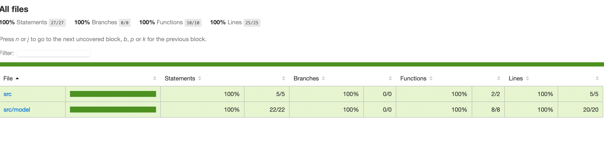

## xml-deserializer

A repository to deserialize xml to typescript objects using `class-converter`

### Usage

- Clone the Repository
- Run `npm install`
- To build `npm build`
- To run tests `npm test`

### What's inside

- `test.xml` to test `Deserialization`
- `Deserializer` class which deserializes the xml to typescript object using `deserialize()` method.

  Initialize Deserializer class using -
  `new Deserialize(xml)`
- `model` contains `class objects and getter methods` of `test.xml` elements.
- `unit.test.ts` - `jest` is used to validate the `deserialization` which covers `100% code coverage`
- `prettier` to run `formatting`
- `tslint` to run `linting`

### Code Coverage

